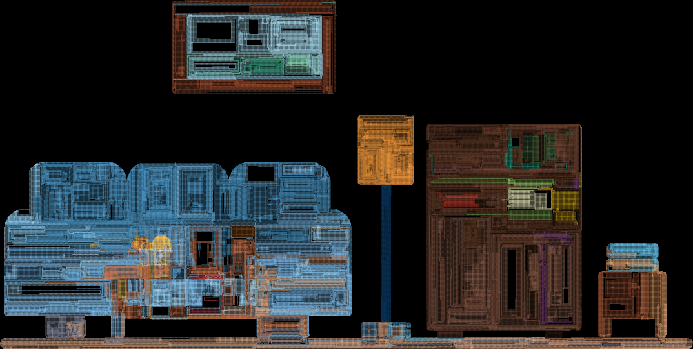

# Tech-Image-Effects
A collection of various image/video effects for use during technical theater. 

## Processing Scripts
For the Processing scripts, smaller images are better. Larger images can be resized using [this website](http://resizeimage.net/), or done locally via [ImageMagick](https://www.imagemagick.org/script/index.php). 

Images can be in `.jpg`, `.png`, `.gif`, or `.tga` format. 

## Sample Settings

## Line Rendering Samples
_Consider adding a brief description of what each setting does._

```java
int stat_type= HUE;
int stroke_len= 3;
int angles_no= 4;
int segments= 747;
float stroke_width= 2.1743276;
int stroke_alpha= 90;
int maxframes= 2000;
```
